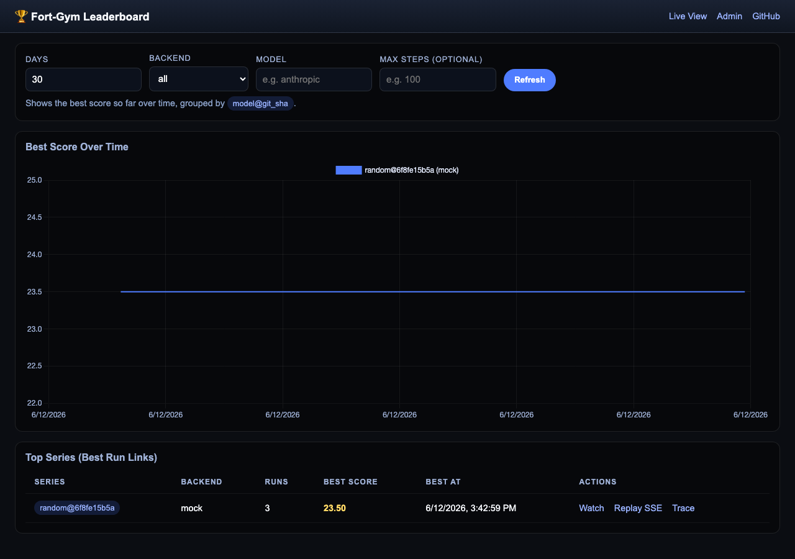

# fort-gym

[](https://github.com/lemoz/fort-gym/actions/workflows/ci.yml)

**An open-source benchmark harness for autonomous agents, set in Dwarf Fortress.** Agents play a live fortress one action per step; the harness records every observation, state, and action to JSONL, streams runs live over SSE, and ranks agents on a public leaderboard.

Dwarf Fortress is a deep, partially observable, long-horizon environment that agents can't memorize their way through — which makes it a useful stress test for the planning, tool-use, and recovery behaviors that matter in real agentic work.



**What's in the box**
- Two backends: a deterministic mock environment for development and CI, and a DFHack-powered backend for live fortress runs on Linux
- One-action-per-step protocol with full JSONL trace capture of every observation, state, and action
- Live run streaming over SSE, with admin and public web UIs
- Job orchestration for 10-run batches, with summaries and a leaderboard
- LLM and agent action adapters — bring your own model
- Ansible-based deploy for running live benchmarks on a GCP VM

## Local (Mock) Quickstart
```bash
git clone https://github.com/lemoz/fort-gym.git
cd fort-gym
python3 -m venv .venv
source .venv/bin/activate
python -m pip install -e '.[dev]'
fort-gym quickstart
```

The quickstart command runs a local mock benchmark, records the trace and summary,
creates a local public share token, then serves the API on `127.0.0.1:8000`. Open
`http://127.0.0.1:8000/leaderboard` to inspect the leaderboard. This path does not
require DFHack or an API key.

If port 8000 is already in use, `fort-gym quickstart` automatically serves on the
next available localhost port. You can also choose one explicitly with
`fort-gym quickstart --port 8018`.

If you only want to generate the run artifacts and start the server later:
```bash
fort-gym quickstart --no-serve
FORT_GYM_INSECURE_ADMIN=1 fort-gym api --no-reload
```

Artifacts (trace JSONL + summary) land under `fort_gym/artifacts/<run_id>/`. You
can replay them via the public UI (`/`) or inspect the leaderboard (`/leaderboard`).

Run the built-in drink-scarcity scenario pack with assertion checks:
```bash
fort-gym scenario-run drink-scarcity
```

The scenario starts the mock fortress below the safe drink threshold and writes
assertion results into `summary.json` under `scenario_assertions`.

To run an LLM agent on the mock backend, install the optional agent dependencies:
```bash
python -m pip install -e '.[agent]'
```

The default LLM provider is OpenRouter (`OPENROUTER_API_KEY`, model
`z-ai/glm-5.2`). Legacy Anthropic agents still exist in the codebase but are
disabled by the API server unless `FORT_GYM_ENABLE_ANTHROPIC=1` is set;
`examples/claude-sonnet-4-6-mock/` is a historical committed trace from that
era, kept for reference.

## Mac Local Development with DFHack

For local development on macOS using the **Lazy Mac Pack** with DFHack, see **[MAC_SETUP.md](MAC_SETUP.md)** for complete instructions including:
- Configuring DF for remote access (TEXT mode, remote plugin)
- Setting `DFROOT` environment variable
- Installing hook scripts
- Running the API against local DF on port 5000

The same fort-gym codebase works on both Mac and Linux—only the `DFROOT` path differs.

## Deploy on a Google Cloud VM (DFHack)
### Prerequisites
- Google Cloud SDK (`gcloud`) configured with project/zone.
- VM firewall needs TCP 80/443 for HTTPS.
- DFHack RPC should stay loopback-only; use SSH tunnels if you need access from your laptop.

### Create the VM + firewall rules
```bash
gcloud compute firewall-rules create allow-fortgym-http-https --allow tcp:80,tcp:443 --direction=INGRESS --target-tags=fortgym
gcloud compute instances create dfhack-host   --machine-type=e2-standard-2   --image-family=ubuntu-2204-lts --image-project=ubuntu-os-cloud   --boot-disk-size=50GB   --tags=dfhack,fortgym
```

### Provision with Ansible (recommended)
1. Edit `infra/ansible/inventory.ini` with your VM IP/user/key.
2. Update `infra/ansible/group_vars/all.yml`:
   - `dfhack_archive_url` (Linux DF+DFHack bundle) and optional checksum.
   - `service_user`/`service_group` (default `ubuntu`).
   - `fortgym_repo_url` (defaults to this repo) & `fortgym_checkout_ref`.
3. Export `FORT_GYM_ADMIN_PASSWORD` before running Ansible (admin endpoints are disabled without it).
4. Run:
   ```bash
   make vm-provision
   make vm-start
   make vm-status
   ```

See `CLAUDE.md` for the current VM workflow (seed saves, systemd services, HTTPS reverse proxy).

## Running DFHack Jobs from the API
With the service running:
```bash
curl -s -X POST http://127.0.0.1:8000/runs \
  -H 'Content-Type: application/json' \
  -d '{"backend":"dfhack","model":"fake","max_steps":50,"ticks_per_step":500}'
```
Then:
```bash
curl -s http://127.0.0.1:8000/runs/<run_id>
curl -N "http://127.0.0.1:8000/runs/<run_id>/events/stream" | head -n 15
ls -l fort_gym/artifacts/<run_id>/
head -n 3 fort_gym/artifacts/<run_id>/trace.jsonl
cat fort_gym/artifacts/<run_id>/summary.json | jq .
```
> Note: the interactive `/step` flow is validated against the single-action schema used by the `fake` agent. Manager orders issued by the exploratory `random` agent remain experimental and may be rejected until DFHack execution coverage improves.
The SSE endpoint emits `state`, `action`, `validation`, `execute`, `advance`, `metrics`, and `score` events. `summary.json` accumulates aggregate metrics, including live DFHack work, completion, utility, production, wealth, and visible fortress complexity progress when target-room metrics are available. Basic survival, population, and drink availability remain bounded health checks; fort-growth components are intentionally open-ended, so longer real-gameplay runs can keep gaining points as the fort digs, builds, produces, and creates wealth.

For legal DFHack-command gameplay, use a governed model:
```bash
# Deterministic reference agent (validates the action substrate)
curl -s -X POST http://127.0.0.1:8000/runs \
  -H 'Content-Type: application/json' \
  -d '{"backend":"dfhack","model":"dfhack-governed-scripted","max_steps":30,"ticks_per_step":1000}'

# LLM policy on the same governed action surface (OpenRouter, default z-ai/glm-5.2)
curl -s -X POST http://127.0.0.1:8000/runs \
  -H 'Content-Type: application/json' \
  -d '{"backend":"dfhack","model":"dfhack-governed-llm","max_steps":30,"ticks_per_step":1000}'
```
Governed runs treat DFHack as a bounded, audited command transport — the agent
issues overseer commands (`DIG`, `BUILD`, `ORDER`, `UNSUSPEND`, `FARM`, `LABOR`,
`WAIT`, `INTERACT`) a human could issue
through the UI, then the simulation must advance and produce observable state
changes. Each accepted governed action is tagged `execute.provenance =
"dfhack_governed"`, per-step metrics carry `score_provenance =
"dfhack_governed_observed_state"`, and every step records a real `screen_text`
CopyScreen frame for replay evidence. Governed target discovery preserves and
restores the live DF camera/cursor so helper probes never disturb the visible
game. `INTERACT` is a zero-tick, paused-dialog action and is never score-progress
eligible by itself. Non-governed models that emit structured governed actions are tagged
`dfhack_assisted`: their progress metrics are zeroed and — once one assisted
action is accepted — the run's scoreable elapsed time is blocked for the rest
of the run. `summary.json` additionally includes a deterministic `rubric`
(8 dimensions over the last 100 trace rows) with explicit blockers such as
`illegal_or_assisted_progress_seen` and `repetitive_policy`.

## Keystroke Control Mode (LLM Plays Through the Raw UI)

The `openrouter-keystroke-perception-review` model controls Dwarf Fortress via raw keystrokes through OpenRouter-compatible chat completions. It requires the agent to submit its own `screen_read` and `last_action_review` before each keystroke action. By default it uses `OPENROUTER_MODEL=z-ai/glm-5.2`; `openrouter-glm-5.2` pins that model explicitly. (The older `anthropic-keystroke*` variants use the same machinery but are disabled unless `FORT_GYM_ENABLE_ANTHROPIC=1`.)

### How It Works
1. **Screen Observation**: The game screen is captured via DFHack's CopyScreen RPC and converted to an 80x25 text representation
2. **Model Decides**: The LLM sees the screen text and decides what keystrokes to send
3. **Keystroke Execution**: Keys are sent via DFHack's `devel/send-key` command
4. **Game Responds**: The game processes the input and advances

### Running Keystroke Mode
```bash
curl -s -X POST http://127.0.0.1:8000/runs \
  -H 'Content-Type: application/json' \
  -d '{"backend":"dfhack","model":"openrouter-keystroke-perception-review","max_steps":10,"ticks_per_step":200}'
```

### Available Keys
Common interface keys include:
- **Navigation**: `CURSOR_UP`, `CURSOR_DOWN`, `CURSOR_LEFT`, `CURSOR_RIGHT`, `CURSOR_UP_Z`, `CURSOR_DOWN_Z`
- **Selection**: `SELECT`, `DESELECT`, `LEAVESCREEN`
- **Main Menus**: `D_DESIGNATE`, `D_BUILDING`, `D_BUILDJOB`, `D_STOCKPILES`, `D_ZONES`, `D_ORDERS`
- **Designate**: `DESIGNATE_DIG`, `DESIGNATE_CHANNEL`, `DESIGNATE_STAIR_DOWN`, `DESIGNATE_CHOP`

Full list of 1600+ keys available via: `dfhack-run lua "@df.interface_key"`

### Example Output
```json
{
  "type": "KEYSTROKE",
  "params": {"keys": ["D_DESIGNATE", "DESIGNATE_DIG", "CURSOR_DOWN", "SELECT"]},
  "intent": "Designating a dig area below current position"
}
```

Generate a leaderboard snapshot for the static site:

```bash
python scripts/publish_leaderboard.py
cat web/leaderboard.json | head
```

## Environment & Keys
Copy the example env and fill it in:
```bash
cp .env.example .env
```
- `OPENROUTER_API_KEY` is the primary LLM key (`OPENROUTER_MODEL` defaults to `z-ai/glm-5.2`).
- `OPENAI_API_KEY` is optional for the OpenAI agents.
- `ANTHROPIC_API_KEY` alone is not enough for Anthropic agents — the API server rejects `anthropic*` models with HTTP 400 unless `FORT_GYM_ENABLE_ANTHROPIC=1` is also set. They are legacy and off by default.
- DFHack backend runs on Linux; macOS typically uses the mock backend or targets the Linux VM.

## Variables Reference (Ansible)
| Variable | Description |
|----------|-------------|
| `dfhack_install_dir` | Path where DF/DFHack is installed (`/opt/dfhack`). |
| `dfhack_archive_url` | URL of Linux DFHack bundle to download. |
| `dfhack_remote_port` | Remote plugin TCP port (default 5000). |
| `service_user` / `service_group` | Unix account running services. |
| `fortgym_repo_url` | Git repository URL (default GitHub). |
| `fortgym_checkout_ref` | Branch/tag for fort-gym checkout. |
| `fortgym_install_dir` | Install path (`/opt/fort-gym`). |
| `fortgym_venv_dir` | Virtualenv directory (`/opt/fort-gym/.venv`). |
| `fortgym_service_enabled` | Enable fort-gym API systemd service (false by default). |
| `fortgym_service_port` | API bind port (default 8000). |
| `allow_tcp_ports` | List of TCP ports opened via UFW (e.g. [22, 80, 443]). |

## Web UI

The web interface at `https://fortgym.live/` (or local dev at `http://127.0.0.1:8000/`) provides:

- **Live Game View** (running runs only): polls the public screenshot endpoint (`/public/runs/{token}/screenshot`, scope `live`) every 500ms and renders the DF screen with [pcface](https://github.com/susam/pcface) CP437 bitmap fonts. This is a genuinely live CopyScreen RPC read of the DF process the server is attached to — it is *not* per-run isolated, so it is only meaningful while that run is the one executing.
- **Replay View** (finished runs, `/r/{token}`): loads the recorded `trace.jsonl` and steps through it. See "Replay Evidence Boundaries" below for exactly what each replay mode does and does not prove.
- **Leaderboard**: Best score over time per backend/model/version (`/leaderboard`).
- **Live/Replay Streams**: SSE event streams (`/public/runs/{token}/events/stream` and `/events/replay`).
- **Admin Panel** (`/admin`): Create runs, manage jobs, generate share tokens (basic auth required; disabled if `FORT_GYM_ADMIN_PASSWORD` is empty).

## Replay Evidence Boundaries

fort-gym separates what is gameplay proof from what is merely helpful. The five surfaces:

| Surface | What it is | Gameplay proof? |
|---|---|---|
| Live screenshot (`/public/runs/{token}/screenshot`) | Live CopyScreen RPC of the currently attached DF process, while a run executes | Live view only — not recorded, not per-run isolated |
| Replay **DF Screen** frames | `screen_text` recorded into `trace.jsonl` each step (keystroke and governed runs) — real CopyScreen text at that moment of play | **Yes** — recorded evidence of the actual game screen |
| Replay **Map Inspect** | `map_snapshot` — a derived DFHack tile read (≤64×64 rect) recorded per step. Labeled on-canvas "DERIVED DFHACK MAP INSPECTION / not gameplay proof" | No — analysis/debugging layer only |
| **No Recorded DF Screen Frame** | Shown for old traces recorded before `screen_text` capture existed. The replay refuses to pass off derived data as a screen | Honest evidence gap — these runs cannot retroactively prove screen state |
| Score + rubric | `composite_score` over observed DF state deltas, provenance-gated; deterministic 8-dimension rubric over the last 100 trace rows with blockers | Scoring judgment over real state — reported alongside, never instead of, the evidence above |

Rules the harness enforces:
- `screen_text` is captured only in keystroke and governed modes. Old traces and toolbox-agent traces have none and display the evidence-gap panel — this is by design, not a bug.
- Structured `DIG`/`BUILD`/`ORDER` from non-governed models is `dfhack_assisted`: progress zeroed, scoreable duration blocked for the rest of the run.
- The debug helper `hook/complete_dig_rect.lua` (instantly converts designated walls to floors) is never gameplay and never scores.

## Security Notes
- Set a non-empty `FORT_GYM_ADMIN_PASSWORD` before exposing the service.
- Keep DFHack RPC on loopback only; do not expose port 5000 directly.
- Serve the API behind HTTPS (Caddy/Nginx) and restrict inbound traffic (GCE firewall/UFW).
- Rotate API keys regularly; never commit `.env` with secrets.

## Agent Memory & Experimentation

These systems are implemented (not roadmap):

1. **Memory** (`fort_gym/bench/agent/memory.py`): `MemoryManager` with a rolling step window, compressed summary of older steps, POIs (points of interest), failed-attempt records, and a gameplay plan with plan reviews. The governed agent can serialize this state through `FORT_GYM_GOVERNED_MEMORY_PATH`; production runs currently disable it because the G5 ablation found the present design counterproductive.
2. **Tools** (`fort_gym/bench/agent/tools.py`): `ToolManager` with memory/plan/perception tools wired into the review-mode agents.
3. **Experimentation** (`fort_gym/bench/experiment/`): YAML config → `ExperimentRunner` → run with experiment metadata.

The latest G7 result is attempt 7, run
`82e5c2e18f6847f1bc251158e273f53e`
([replay](https://fortgym.live/r/5dk997_GsCm1IJoKzGL_cLy8On3U7Hxz)),
from deployed SHA `b38c40a255db62ae52c940f81883c8097e7ac273`. It made genuine
early progress through legal governed actions and real simulation ticks: a
completed Carpenter's Workshop and Still, two beds, one door, four new barrels,
and 50 units of run-scoped drink. It still had zero FarmPlots, installed
furniture, enclosed spaces, or functional rooms. The run failed before gameplay
at step 17 because its bounded model-correction loop exposed contract errors one
at a time. It advanced 17,064 ticks and is an infrastructure-aborted G7 FAIL
with no long-horizon policy verdict. The correction path now preserves the
rejected payload and aggregates every independently detectable action and review
error before spending another model submission.

Attempt 5, run `680a938aabd84764953dd01c0ccf1c7f`
([replay](https://fortgym.live/r/88uZqRulANyNG_e7t7c6KFlEOYRvHZdz)),
remains the longest region3 attempt at 201,556 ticks. It failed on a bounded
topic-dialog variant, with zero food/drink production, final drink 0, one
functional room, score-v3 178.59, and deterministic G7 FAIL. Attempt 4, run
`45659da07fb749f9b5ebe9c55dd1eb91`, is an infrastructure-aborted FAIL with no
policy verdict ([replay](https://fortgym.live/r/4Gn9v9WaPf_i4qhGJFQs9bo9d8y_GSBo)).
It completed 208 governed rows and 202,737 ticks before a bounded dialog guard
failed it cleanly. The run made real furniture, a farm, and 40 construction
tiles, but ended with zero drink production and zero functional rooms.

Forensics found that all 36 pending construction jobs had reserved materials no
citizen could reach, while four brew orders were falsely accepted without a
completed Still or real brew jobs. PR #70's deployed correction selects only
materials in a living citizen's current DF walk group, limits placement to a
conservative dry/visible floor subset, fails closed on incomplete
workshop/order postconditions, and exposes job walk-group connectivity to the
model. It also adds a view-specific `finish_topic_meeting` operation using the
live-verified `OPTION1` key. Its deployed fresh-seed boundary smoke passed before
attempt 5 launched. PR #72 adds factual governed action history and PR #73
grounds BUILD footprints. PR #74 adds visible letter-option dialog input and
factual, model-authored action/plan reviews; it still leaves every
gameplay objective and command to the model. Review evidence comes only from a
runner-authored allowlist, repeated commands are bound to a stable type+params
fingerprint, and governed history retains at least the six entries required for
review continuity. Full findings and gate predicates are recorded in
`docs/WDSLL.md`.

**Success definition and gate ladder: [docs/WDSLL.md](docs/WDSLL.md)** — every claim of "the agent plays" must pass a gate there on public, replayable evidence.

## Troubleshooting
- **DFHack service won't start**: check `/var/log/syslog` and `journalctl -u dfhack-headless`. Verify `dfhack_archive_url` points to a Linux build.
- **Remote not listening**: ensure the remote plugin is enabled; run `ss -lntp | grep 5000`.
- **SSE shows no events**: inspect API logs (`journalctl -u fort-gym-api -f` on the VM) and confirm the share token has `live` scope.
- **Jobs stall**: query `/runs/<id>` to check progress, tail `journalctl -u fort-gym-api -f`, and ensure DFHack is responsive (`/opt/dwarf-fortress/dfhack-run lua 'print(dfhack.getSavePath())'`).
- **Missing DFHack protobuf bindings**: the `make proto` helper expects protos in `fort_gym/bench/env/remote_proto/sources`. If upstream URLs move, copy the `.proto` files out of `/opt/dfhack-src` and regenerate with the commands listed above.
- **LLM invalid actions**: adjust prompts or ACTION_TOOL_SPEC usage; ensure the tool call returns a single action dict.
